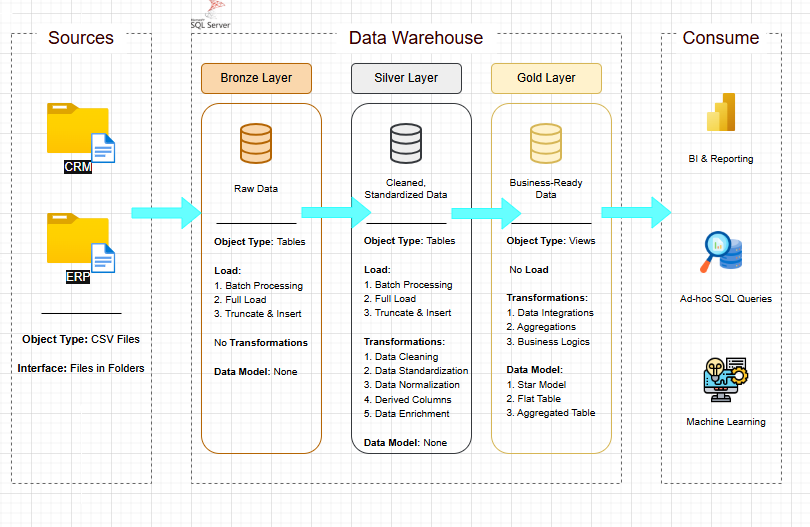

# Data Warehouse & Analytics Project

This project consolidates sales data from two source systems (ERP and CRM) into a unified data warehouse optimized for analytics and reporting.

## 🏗️ Data Architecture

The data architecture for this project follows Medallion Architecture **Bronze**, **Silver**, and **Gold** layers:


1. **Bronze Layer**: Stores raw data as-is from the source systems. Data is ingested from CSV Files into SQL Server Database.
2. **Silver Layer**: This layer includes data cleansing, standardization, and normalization processes to prepare data for analysis.
3. **Gold Layer**: Houses business-ready data modeled into a star schema required for reporting and analytics.

## 📊 Analytics Framework
Comprehensive analytical approach covering:

### Exploratory Data Analysis
- **Database Exploration**: Schema and structure analysis
- **Dimensions Analysis**: Customer geography, product hierarchy
- **Date Analysis**: Temporal coverage and customer demographics
- **Measures Analysis**: Key business metrics and KPIs
- **Magnitude Analysis**: Distribution across dimensions
- **Ranking Analysis**: Top and bottom performers

### Advanced Analytics
- **Change Over Time**: Monthly trends and seasonality
- **Cumulative Analysis**: Running totals and progressive growth
- **Performance Analysis**: Product performance vs. benchmarks
- **Part-to-Whole**: Category contribution analysis
- **Data Segmentation**: Customer and product segmentation

### Business Reports
- **Customer Report**: Comprehensive customer analytics with segmentation
- **Product Report**: Product performance and lifecycle analysis

## 📂 Repository Structure
```
data-warehouse-project/
│
├── datasets/                           # Raw datasets used for the project (ERP and CRM data)
│
├── docs/                               # Project documentation and architecture details
│   ├── architecture.png                # Picture shows the project's architecture
│   ├── data_catalog.md                 # Catalog of datasets, including field descriptions and metadata
│   ├── data_flow.png                   # Picture for the data flow diagram
│   ├── data_model.png                  # Picture file for data models (star schema)
│   ├── data-integration.png            # Picture file for the data integrations to understand business objects
│
├── scripts/                            # SQL scripts for ETL and transformations
│   ├── bronze/                         # Scripts for extracting and loading raw data
│   ├── silver/                         # Scripts for cleaning and transforming data
│   ├── gold/                           # Scripts for creating analytical models
    ├──  analytics/                     # Analytical queries
      ├── exploratory/                  # EDA queries
      ├── advanced/                     # Advanced analytics
      └── reports/                      # Business reporting
│
├── tests/                              # Test scripts and quality files
│
├── README.md                           # Project overview and instructions
├── LICENSE                             # License information for the repository
```
